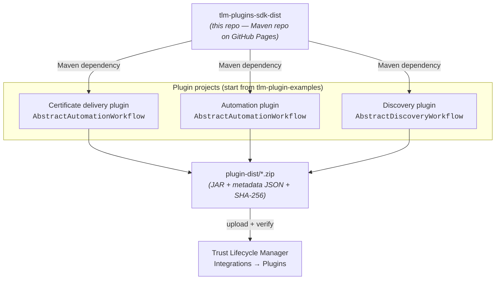

# TLM Plugins SDK — Distribution

Public distribution repository for the **DigiCert Trust Lifecycle Manager (TLM) Plugins SDK**.

This repository is the **package host**, not the source. It publishes the SDK's Maven
artifacts (JARs and POMs) as a **static Maven repository on GitHub Pages** so that you can
add the SDK as a dependency and build your own TLM plugins. Use it to pull a released SDK
version into your plugin project, then package and upload the result to Trust Lifecycle Manager.

**Maven repository (GitHub Pages):** <https://digicert.github.io/tlm-plugins-sdk-dist/>

- **You are here:** the SDK distribution (a Maven repository hosted on GitHub Pages).
- **Where you build:** your own plugin project, typically started from an
  [official example](#examples).
- **Where you deploy:** Trust Lifecycle Manager → **Integrations → Plugins**.

> For product concepts and the full plugin walkthrough, see the official docs:
> [Build your plugin](https://docs.digicert.com/en/trust-lifecycle-manager/build-your-inventory-and-ecosystem/plugins/build-your-plugin.html).

---

## Contents

- [How it fits together](#how-it-fits-together)
- [Supported plugin workflows](#supported-plugin-workflows)
- [Prerequisites](#prerequisites)
- [Consume the SDK](#consume-the-sdk)
  - [1. Declare the repository](#1-declare-the-repository)
  - [2. Add the SDK dependency](#2-add-the-sdk-dependency)
- [Build and package a plugin](#build-and-package-a-plugin)
- [Deploy to Trust Lifecycle Manager](#deploy-to-trust-lifecycle-manager)
- [Examples](#examples)
- [Versioning](#versioning)
- [Support](#support)
- [License](#license)

---

## How it fits together

The SDK is published here once and consumed by every plugin project. Each plugin
implements one workflow type, builds to a distributable ZIP, and is uploaded to TLM.



**Flow:** add the SDK dependency → implement your workflow logic → `./build.sh` produces a
signed ZIP in `plugin-dist/` → upload the ZIP + configuration JSON to TLM → verify and activate.

---

## Supported plugin workflows

A plugin implements exactly one of the three workflow types that Trust Lifecycle Manager
recognizes. Each maps to an SDK base class you extend and a small set of methods you override.

| Workflow | What it does | SDK base class | Typical methods to implement |
| --- | --- | --- | --- |
| **Certificate delivery** | Request and deliver certificates to a target system type. | `AbstractAutomationWorkflow` | `testConnection`, `generateCsr`, `installCertificate`, `validateCertificate` |
| **Automation** | Manage and automate certificate lifecycles (renewal, rotation, inventory) on network appliances and cloud services. | `AbstractAutomationWorkflow` | `testConnection`, `generateCsr`, `installCertificate`, `validateCertificate`, `refreshConfiguration` |
| **Discovery** | Import certificate/endpoint inventory from a third-party scan provider. | `AbstractDiscoveryWorkflow` | `testConnection`, `getDiscoveryData`, `getUserDetails` |

Configuration properties (credentials, URLs, network settings) are declared in your
plugin's configuration class and mirrored in the configuration JSON you upload to TLM.

References:
[Automation plugins](https://docs.digicert.com/en/trust-lifecycle-manager/build-your-inventory-and-ecosystem/plugins/build-your-plugin/build-automation-plugins.html) ·
[Discovery plugins](https://docs.digicert.com/en/trust-lifecycle-manager/build-your-inventory-and-ecosystem/plugins/build-your-plugin/build-discovery-plugins.html) ·
[Add a plugin](https://docs.digicert.com/en/trust-lifecycle-manager/build-your-inventory-and-ecosystem/plugins/add-a-plugin.html)

---

## Prerequisites

- **Java** 17 or later (JDK) and **Apache Maven** 3.6+.
- Access to a **Trust Lifecycle Manager** account to upload and activate the finished plugin.

No GitHub account or access token is required — the SDK is served from a public GitHub Pages
Maven repository.

---

## Consume the SDK

The SDK is distributed as a **static Maven repository hosted on GitHub Pages**. It requires
**no authentication** — no GitHub account, personal access token, or `settings.xml` entry.
Consuming it takes two steps: point Maven at the GitHub Pages URL, then declare the dependency.

**Maven repository URL:** `https://digicert.github.io/tlm-plugins-sdk-dist/`

### 1. Declare the repository

In your plugin project's `pom.xml`, add the GitHub Pages Maven repository.

```xml
<repositories>
  <repository>
    <id>tlm-plugins-sdk</id>
    <url>https://digicert.github.io/tlm-plugins-sdk-dist/</url>
  </repository>
</repositories>
```

### 2. Add the SDK dependency

Declare the SDK using its published Maven coordinates.

```xml
<dependencies>
  <dependency>
    <groupId>com.digicert.tlm</groupId>
    <artifactId>plugin-sdk</artifactId>
    <version>1.1</version>
  </dependency>
</dependencies>
```

Then resolve it as usual (`mvn dependency:resolve` or any build that triggers dependency
resolution).

> **Available versions** are listed in the repository's Maven metadata:
> [`com/digicert/tlm/plugin-sdk/maven-metadata.xml`](https://digicert.github.io/tlm-plugins-sdk-dist/com/digicert/tlm/plugin-sdk/maven-metadata.xml).
> Always pin to a specific released version so plugin builds stay reproducible. The example
> projects already reference the correct coordinates — the fastest path is to start from one.

---

## Build and package a plugin

The example projects are Maven projects that bundle a build script. From the project root:

```bash
./build.sh
```

The build compiles your plugin, resolves the SDK from the GitHub Pages Maven repository, and
produces a distributable archive in the **`plugin-dist/`** subdirectory. The archive contains:

- the plugin **JAR**,
- the **metadata JSON** required by Trust Lifecycle Manager, and
- a **SHA-256** checksum for integrity verification.

Keep the plugin ZIP under **100 MB** — that is the upload limit enforced by TLM.

---

## Deploy to Trust Lifecycle Manager

1. In Trust Lifecycle Manager, go to **Integrations → Plugins** and select **Add plugin**.
2. Upload the **plugin ZIP** (from `plugin-dist/`) and its **configuration JSON**.
3. Choose the **workflow type** — Certificate delivery, Automation, or Discovery — and the
   target OS (Linux, Windows, or Cross platform). Provide name, vendor, version (`x.x.x`),
   and an optional description.
4. Select **Verify and create**. TLM scans the package for malicious content; verification
   can take up to ~10 minutes before the plugin becomes **Active** and usable.

Full steps: [Add a plugin in Trust Lifecycle Manager](https://docs.digicert.com/en/trust-lifecycle-manager/build-your-inventory-and-ecosystem/plugins/add-a-plugin.html).

---

## Examples

Working, buildable starting points for each workflow type are published in the consolidated
examples repository:

**➡️ [digicert/tlm-plugin-examples](https://github.com/digicert/tlm-plugin-examples)**

It contains one example per workflow — certificate delivery, automation, and discovery.
Clone the example that matches your use case, adapt the workflow class and configuration,
then build and upload as described above.

---

## Versioning

- SDK artifacts follow **semantic versioning**.
- Released versions are listed in the repository's Maven metadata:
  [`maven-metadata.xml`](https://digicert.github.io/tlm-plugins-sdk-dist/com/digicert/tlm/plugin-sdk/maven-metadata.xml);
  always depend on a fixed released version.
- Pin the SDK version in your `pom.xml` so plugin builds stay reproducible.

---

## Support

For access, integration guidance, or help scoping a custom plugin, contact your **DigiCert
account representative or solutions engineer**, or open an issue in the relevant public
repository. Product documentation:
[Trust Lifecycle Manager plugins](https://docs.digicert.com/en/trust-lifecycle-manager/build-your-inventory-and-ecosystem/plugins.html).

---

## License

Licensed under the [Apache License 2.0](./LICENSE).
